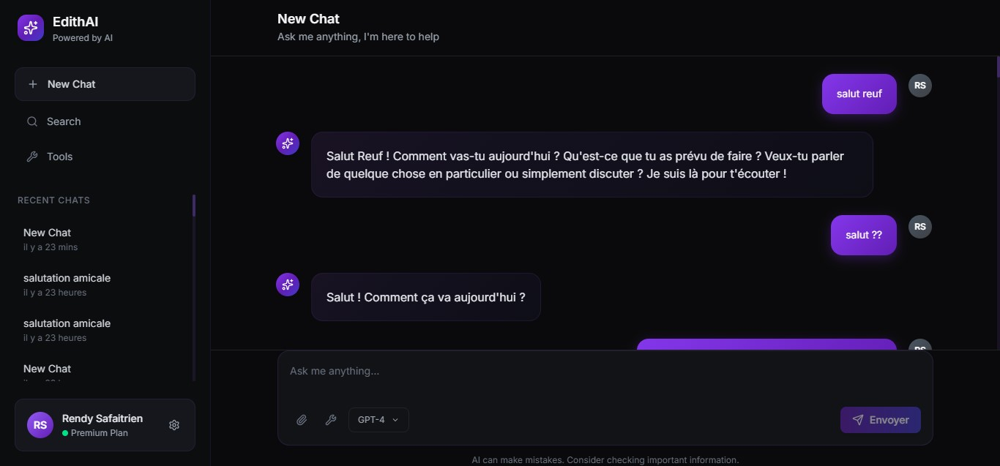

[]

# EdithAI Personal : Agent IA capable d'effectuer des tâches

**EdithAI Personal** est un agent d'intelligence artificielle conçu pour répondre aux questions et effectuer des tâches selon les outils disponibles. Ce projet met l'accent sur la flexibilité, l'extensibilité et la simplicité d'installation, permettant aux développeurs d'ajouter facilement leurs propres outils pour répondre à des besoins spécifiques.

---

## Nouveautés et améliorations

- **Lancement direct du chat** : Plus besoin de cliquer sur *New Chat*, la conversation démarre automatiquement.
- **Installation simplifiée** : Plus de configuration complexe, plus besoin de VirtualHost ou de modifier `.htaccess`. Le projet fonctionne sur tout serveur supportant PHP (Windows, Linux, Mac).
- **Responsive design amélioré** : Support complet pour Android/iOS et tous types d'écrans.
- **Adaptation automatique** : Le projet s'adapte à votre environnement sans configuration manuelle.
- **Gestion des redirections** : Les problèmes de redirection sont corrigés, mais peuvent subsister sur certains appareils.
- **Support Linux** : Cloner le projet, installer PHP/Apache, et lancez-le sans configuration supplémentaire.
- **Mises à jour continues** : De nombreuses améliorations et nouvelles fonctionnalités sont en cours de développement.

---

## Installation

### 1. Prérequis

- Un serveur web supportant PHP (Apache, Nginx, etc.)
- Git (pour cloner le dépôt)

### 2. Cloner le dépôt

```bash
git clone https://github.com/Onestepcom00/EdithAI_Personal
```

### 3. Lancer le projet

- Placez le dossier cloné dans le répertoire web de votre serveur (ex : `www` ou `htdocs`).
- Démarrez votre serveur web.
- Accédez à l'adresse locale correspondante (ex : `http://localhost/EdithAI_Personal`).

### 4. Configuration API (si nécessaire)

- Si vous rencontrez des erreurs d'appel API, ouvrez le fichier `/public_html/assets/js/config.js` et modifiez uniquement les routes API pour les adapter à votre environnement.
- Modifiez également les liens API dans `public_html/config.php` si besoin.

---

## Fonctionnalités principales

- **Réponses intelligentes** : EdithAI Personal comprend et répond aux questions des utilisateurs.
- **Exécution de tâches** : L'agent peut effectuer diverses tâches selon les outils intégrés.
- **Extensible** : Les développeurs peuvent créer et intégrer leurs propres outils, que l'IA utilisera automatiquement selon la demande.
- **Architecture Tool Management (Librix)** : Gestion centralisée et dynamique des outils côté backend.
- **Responsive** : Utilisable sur desktop, Android et iOS.

---

## Détails techniques

- **Backend** : PHP avec architecture Tool Management (Librix)
- **Frontend** : HTML, TailwindCSS, JavaScript
- **Configuration simplifiée** : Plus besoin de VirtualHost ou `.htaccess`
- **Fichiers à modifier en cas de besoin** :
    - `/public_html/assets/js/config.js` : Modifier les routes API si nécessaire.
    - `/public_html/config.php` : Modifier les liens API selon votre environnement.

---

## Explication des dossiers et fichiers

- **public_html/** : Frontend de l'application.
    - `loader.php` : Fonctions réutilisables.
- **system/** : Backend et gestion des outils.
    - `api/` : Routes API, gestion du chat et sauvegarde.
    - `mcp/` : Tools management, préparation et fourniture des outils à l'IA.
    - `tools/` : Placez ici vos outils personnalisés.

---

## Conclusion

Le projet est désormais plus simple à installer et à utiliser, tout en restant flexible et extensible. N'hésitez pas à explorer, modifier et améliorer EdithAI Personal selon vos besoins. Pour toute collaboration ou suggestion, contactez-nous !

---

## Auteur

**Exauce Stan Malka** (Exauce Malumba)  
Développeur fullstack, pentesteur senior, ingénieur IA  
Onestep / Kreatyva  
Contact : exaustanmalka@icloud.com / +243 977482151

---

## Librix & Création des outils

Un dépôt dédié sera créé pour détailler la création et l'intégration d'outils personnalisés. Restez connectés pour plus d'informations et de ressources à venir.
